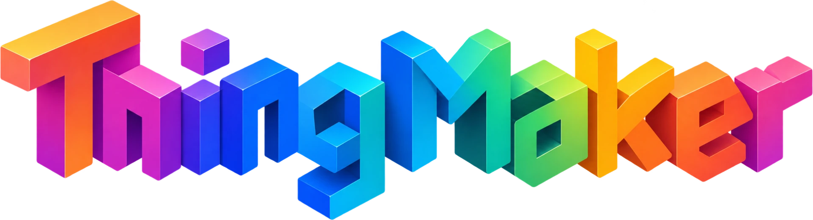
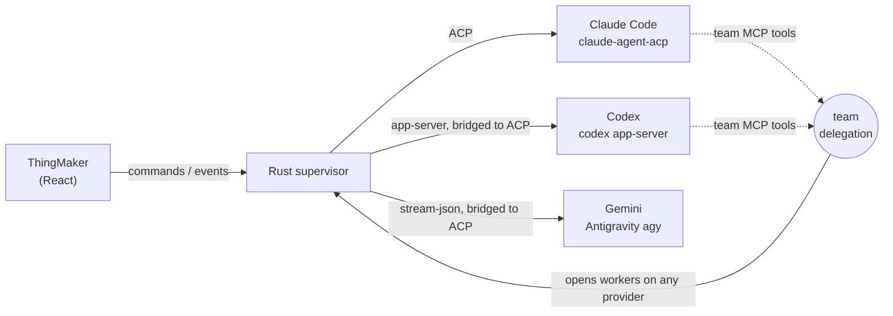

<p align="center">
  
</p>

<p align="center">
  <strong>One desktop for all your AI coding subscriptions.</strong><br>
  An orchestrator on one provider, a team of workers on all of them, working toward the same goal.
</p>

<p align="center">
  
  
  
  
  
  <a href="LICENSE"></a>
</p>

---

ThingMaker runs **Claude Code**, **Codex** and **Gemini** side by side, on the
subscriptions you already pay for. Have Claude Opus lead and send image work to
GPT-6 Luna. Let a Codex orchestrator hand reviews to Sonnet. Run a long goal that
keeps working while you sleep and moves to another account when one runs out.
Watch everything — every agent,
every tool call, every image it makes — in one window.

No API keys, ever. ThingMaker drives each provider's **own official program**
with your own sign-in, and never reads, stores or passes on a token.

## Why

- **Spread your usage.** Small plans on several providers go further together.
  Work is routed to the account with the most room, and a job that hits a limit
  waits and resumes instead of failing.
- **Use each model for what it's best at.** Claude for code, GPT for images,
  a fast model for the mechanical bits. You decide the team; the orchestrator
  decides who gets which task.
- **One place for all of it.** Sessions, transcripts, diffs, terminals and
  images from every provider, in the same interface.

## Highlights

|  |  |
| --- | --- |
| 🧑‍🤝‍🧑 **Teams** | Any session can lead a team. Pick the orchestrator (provider, model, effort) and its workers, each with capabilities like `image`, `code` or `review` and a note on when to use it. Change the team mid-session. Save combinations as **presets** and start a session from one. |
| 🔀 **Cross-provider delegation** | The orchestrator gets `team` tools — `list_workers`, `delegate`, `await_jobs` — and hands self-contained tasks to workers on any provider. Workers are real sessions you can open and watch, each marked with its provider's icon. |
| ⏳ **Limits, handled** | Routing picks the worker whose account has the most headroom. When a worker hits a temporary limit (an image generation cap, a usage window, an overloaded server) the job waits — until the provider's own reset when it names one — then the same worker carries on with its context. |
| 📊 **Live usage** | Five-hour and weekly windows for Claude and Codex in the sidebar, read from each provider's own program at no cost. |
| 🧭 **Big Thing** | A long-horizon goal runner: drop in a plan document and the agent turns it into milestones and tasks with their dependencies and checks; press Start and it runs to the end on its own — see [Big Thing](#big-thing) below. |
| 🧠 **Shared memory** | One project memory — decisions, conventions, facts — that the orchestrator, its workers and you read and write (`memory_read`, `memory_write`), plus a live task board. |
| 🖼️ **Inline images** | Images agents generate or read show up right in the transcript, including Codex's generated images. |
| 🔌 **MCP servers in one click** | Install Playwright, Context7, GitHub and others from a catalog, or paste any server's config or `mcp add` command. ThingMaker test-starts it, then writes it through each provider's own `mcp add`, so Claude Code, Codex and Antigravity all have it. Secrets stay in the keychain as `${NAME}` references. |
| 🔍 **Review and tools** | Diffs and baselines, git staging and commits, worktrees, an integrated terminal, file browsing, artifacts and skills. |
| 🔐 **Your accounts, your machine** | Each provider signs in through its own flow and keeps its own credentials. Switch accounts from the Providers panel. Everything runs locally. |

## How it works



- The **supervisor** owns every agent process and speaks the
  [Agent Client Protocol](https://agentclientprotocol.com) to all of them.
  Providers that speak something else get a small bridge inside the supervisor.
- An orchestrator's **`team` MCP server** is a relay that connects back to
  ThingMaker over a private local socket (no network port). Its `delegate`
  calls open worker sessions on whichever provider the team names.
- Each provider's quota is read the provider's own way and fed to the router.
- **Big Thing** is an engine inside the supervisor, not the window: it drives
  sessions through the same actors the tabs attach to and keeps going while
  ThingMaker sits in the menu bar with no window open.

## Big Thing

Big Thing is for work that takes more than one turn — a roadmap, a feature
spec, a migration.

1. **Plan.** Create a goal on a session and drop a Markdown plan on it. The
   agent reads it and proposes ordered milestones, each with the document's
   substance, a check Big Thing can run (your test command, a command that must
   exit 0, files that must exist) and three to eight tasks with their
   dependencies and the kind of worker each needs. The goal stays a draft until
   you review it and press **Start**.
2. **Run.** Big Thing briefs the session once, then sends a short continuation
   after every turn. A milestone is done when its check passes — read from the
   agent's own tool results or run by Big Thing — never on the agent's word.
   Every decision goes into the goal's journal first.
3. **Report.** The agent talks back through tools — `bigthing_report`,
   `bigthing_task`, `bigthing_ask`, `bigthing_amend` — each checked against the
   plan on the spot. Questions and plan changes land in the goal's **Inbox**;
   you answer while the run carries on.
4. **Stay within the accounts.** Each turn's cost is measured. A turn that
   would not fit is moved to an account with room or held until the window
   resets; a spent account parks the run and resumes it by itself. With
   *spread*, the run moves to the account with the most room at each milestone.

Options per goal:

- **Who hands out the tasks.** The orchestrator delegates, or Big Thing hands
  every ready task to the team's workers itself, in parallel, by capability —
  optionally with a review of each result on another provider.
- **Its own branch.** The run works in a Git worktree on `bigthing/<goal>`.
  Every turn is a commit; roll back to any checkpoint, then merge back into
  your checkout when you are happy (conflicts are named, nothing is forced).
- **A team preset**, so the run starts with the orchestrator and workers you
  saved, and keeps them on every account it moves to.

The **Team** tab shows who led each milestone on which provider and model,
which worker did each task, and the project memory.

| Provider | Program it runs | Signs in with | Roles |
| --- | --- | --- | --- |
| Claude Code | [`claude-agent-acp`](https://www.npmjs.com/package/@agentclientprotocol/claude-agent-acp) (Anthropic's Agent SDK over ACP) | Claude Pro, Max, Team or Enterprise | orchestrator, worker |
| Codex | `codex app-server` (CLI or the ChatGPT app's bundled one) | ChatGPT plan | orchestrator, worker |
| Gemini | Antigravity CLI `agy` | Google account | worker, plain session |

## Getting started

### 1. Install the providers you use

- **Claude Code:** `npm install -g @agentclientprotocol/claude-agent-acp`, then
  sign in from ThingMaker's Providers panel (or with `claude` once).
- **Codex:** install the [ChatGPT app](https://openai.com/chatgpt/download/)
  (its `codex` is found automatically) or the `codex` CLI, and sign in.
- **Gemini:** install Google's Antigravity and sign in to its `agy` CLI; the
  quota is your Google account's, shared with the Antigravity app.

### 2. Build and install ThingMaker

You need Rust (stable), Node 24 (via [nvm](https://github.com/nvm-sh/nvm)),
pnpm 10 and Xcode's command line tools.

```bash
git clone https://github.com/Pau-mbox/ThingMaker.git && cd ThingMaker
```

```bash
pnpm install
```

```bash
pnpm app
```

`pnpm app` builds a release `ThingMaker.app` and installs it in
`/Applications`. Run it again whenever you pull changes; a running ThingMaker
picks up the new build when you reopen it.

### 3. Your first team

1. Open ThingMaker and **add a project folder**.
2. Open **Teams** (the icon next to Settings, bottom left) and create a preset — for
   example *Claude Opus 5.5 leads; Codex GPT-6 Luna for `image`; Sonnet 5.5
   for `review`*.
3. In the project, click your preset under **Start with a team** and describe
   the goal. The orchestrator plans, delegates and reports back; follow the
   jobs in the **Agents** tab.
4. For something bigger, open the session's **Big Thing** tab, drop your plan
   document on the form, review the milestones it proposes, and press
   **Start**.

## Development

```bash
pnpm dev
```

Runs **ThingMaker Dev**, a separate app identity with its own data, so it never
touches your installed ThingMaker.

```bash
pnpm typecheck && pnpm test
```

```bash
cargo test --workspace --exclude thingmaker-desktop && cargo clippy --workspace --all-targets -- -D warnings
```

Live tests against the real providers are opt-in and spend a few tokens:
`THINGMAKER_REAL_CLAUDE=1`, `THINGMAKER_REAL_CODEX=1`, `THINGMAKER_REAL_GEMINI=1`, `THINGMAKER_REAL_DELEGATION=1`, `THINGMAKER_REAL_BIGTHING=1`.

| Where | What |
| --- | --- |
| `apps/desktop` | the Tauri app: React interface (`src/`) and the host's commands (`src-tauri/`) |
| `crates/thingmaker-supervisor` | the engine: transport, ACP client, provider bridges, delegation, Big Thing (`bigthing/`), session actors, storage |
| `packages/contracts` | the TypeScript types of the desktop API |
| `packages/test-fixtures` | mock providers, captured from the real programs |
| `runtime/` | the `big-thing` skill the agents load, and the Claude Code delegate definition |
| `docs/` | [architecture](docs/architecture.md), [decisions](docs/adr/README.md), [release](docs/release.md) |

## Principles

- **Subscriptions only.** No API-key billing, no token extraction, no proxying
  credentials, no rotating accounts to dodge limits — see
  [ADR-009](docs/adr/ADR-009-providers-through-official-programs.md).
- **Official programs.** ThingMaker drives the CLI each provider ships, the way
  it is meant to be embedded.
- **Nothing hidden.** Every agent, tool call and decision is on screen, and the
  transcripts stay in each provider's own store.

## Status

ThingMaker is young and moving fast. It is built and used daily on macOS
(Apple silicon).

## License

[MIT](LICENSE)
